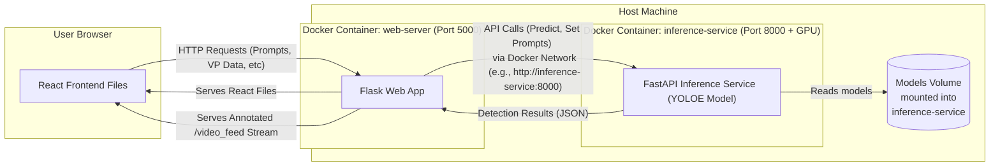

# Real-Time Construction Site PPE Detection (YOLOE - Dockerized)


This project provides a web-based system for real-time monitoring of Personal Protective Equipment (PPE) compliance on construction sites using the YOLOE object detection model. It features text-based and visual prompting, served via a modern web interface. This version is containerized using Docker and Docker Compose for simplified deployment and dependency management.


**Core Components (Containerized):**

1.  **`inference-service` (FastAPI):** A Docker container running a FastAPI application that hosts the YOLOE model(s) and performs efficient object detection inference via API endpoints. Supports separate models for text and visual prompts. Requires GPU access via NVIDIA Container Toolkit.
2.  **`web-server` (Flask + React):** A Docker container running a Flask application that serves the built React frontend, manages video input (webcam or file), handles user interactions (setting prompts), and communicates with the `inference-service` for results.


## Features

*   **Containerized Deployment:** Easily deployable using Docker Compose.
*   **Real-Time Detection:** Processes video streams (webcam or uploaded file) to detect objects.
*   **YOLOE Model:** Leverages the powerful YOLOE model for object detection/segmentation.
*   **Text Prompts:** Define target object classes using text input (e.g., "person, hard hat, safety vest").
*   **Visual Prompts:** Interactively draw bounding boxes on a frame to define specific objects visually.
*   **Annotated Stream:** Displays the video feed with bounding boxes, class labels, confidence scores, and optional tracking IDs overlaid.
*   **Modern Web Interface:** User-friendly interface built with React for controlling prompts and viewing results.
*   **Decoupled Architecture:** Separate services for inference and web serving allow for scalability and independent development, managed by Docker Compose.


## Architecture (Docker Compose)

The system runs as two interconnected Docker containers:



1. The user accesses the React Frontend served by the Flask container (web-server) at http://localhost:5000.

2. User actions (setting prompts, uploading video, submitting visual prompts) trigger API calls from React to the Flask container.

3. The Flask container handles video input and the /video_feed streaming endpoint.

4. For inference, Flask makes API calls (e.g., http://inference-service:8000/predict_text) over the Docker network to the FastAPI container (inference-service).

5. The FastAPI container accesses the GPU (via NVIDIA Container Toolkit) and mounted model files to perform inference.

6. Detection results (JSON) are sent back from FastAPI to Flask.

7. Flask annotates the video frame and streams it via /video_feed back to the React frontend.

## Technology Stack

*   **Backend:** Python
    *   **Inference Service:** FastAPI, Uvicorn, Ultralytics YOLOE, Supervision, PyTorch, Pydantic
    *   **Web Server:** Flask, Requests, Gunicorn
*   **Frontend:** JavaScript, React, Vite (build tool), CSS
*   **Machine Learning:** YOLOE (Ultralytics implementation)
*   **Containerization:** Docker, Docker Compose
*   **GPU Support:** NVIDIA Container Toolkit

## Setup and Installation

**Prerequisites:**

*   **Docker Engine:** Install Docker for your operating system.
*   **Docker Compose:** Usually included with Docker Desktop. Verify with `docker compose version`.
*   **Git:** For cloning the repository.
*   **NVIDIA GPU & Drivers:** A CUDA-enabled NVIDIA GPU is required for the inference service.
*   **NVIDIA Container Toolkit:** Essential for Docker to access the GPU. Install following the official NVIDIA documentation for your OS: [NVIDIA Container Toolkit Installation Guide](https://docs.nvidia.com/datacenter/cloud-native/container-toolkit/latest/install-guide.html). **Restart the Docker daemon/service after installation.**

**Steps:**

1.  **Clone the Repository:**
    ```bash
    git clone <your-repository-url>
    cd <your-repository-name>
    ```

2.  **Download YOLOE Models:**
    *   Obtain the necessary YOLOE model weights (`.pt` files) you intend to use (e.g., `yoloe-l-seg.pt`).
    *   Place these model files inside the `models/` directory in the project root.

3.  **Configure Inference Service:**
    *   Create the `.env.inference` file in the project root (alongside `docker-compose.yml`).
    *   Populate it with the correct paths *relative to the mount point inside the container* and other settings:
        ```env
        # .env.inference EXAMPLE
        TEXT_MODEL_PATH=/app/models/yoloe-l-seg.pt # Adjust filename if different
        VP_MODEL_PATH=/app/models/yoloe-l-seg.pt  # Adjust filename if different
        DEVICE=cuda
        DEFAULT_CONFIDENCE=0.3
        LOG_LEVEL=INFO
        PORT=8000
        HOST=0.0.0.0
        ```
## Configuration Summary

*   **Inference Service (`.env.inference`):**
    *   `*_MODEL_PATH`: **Must point to `/app/models/your_model.pt`**. These are the paths *inside* the container where the `models` directory is mounted.
    *   `DEVICE`: Set to `cuda`.
    *   `DEFAULT_CONFIDENCE`: Adjust detection threshold.
    *   `LOG_LEVEL`: Controls FastAPI logging verbosity.
*   **Web Server (`docker-compose.yml` environment section for `web-server`):**
    *   `MODEL_SERVICE_URL`: Automatically set by Docker Compose to `http://inference-service:8000`, allowing Flask to find the FastAPI container by its service name.
*   **React Build:** Handled automatically during the `web-server` image build process defined in `Dockerfile.flask`.


4.  **Build and Run with Docker Compose:**
    *   Open a terminal in the project's root directory (where `docker-compose.yml` is located).
    *   Run the following command:
        ```bash
        docker compose up --build
        ```
        *   `--build`: Builds the images for both services based on their Dockerfiles. Required on first run or after changes to Dockerfiles or application code/dependencies.
        *   `-d`: (Optional) Add `-d` to run the containers in detached mode (in the background): `docker compose up --build -d`.
    *   This command will:
        *   Build the `frontend` React app (as part of the `Dockerfile.flask` build process).
        *   Build the Docker images for `inference-service` and `web-server`.
        *   Create and start containers for both services.
        *   Mount the `models` directory and `.env.inference` file into the `inference-service` container.
        *   Set up the Docker network for communication between containers.


## Running the Application

1.  **Start Containers:** Use `docker compose up --build` (or `docker compose up` if images are already built).
2.  **Access the Web Interface:** Open your web browser and navigate to `http://localhost:5000`.
3.  **Monitor Logs:** View combined logs in the terminal where you ran `docker compose up`. If running detached (`-d`), use `docker compose logs -f` to follow logs.
4.  **Stop Containers:** Press `Ctrl+C` in the terminal (if running attached) or run `docker compose down` (stops and removes containers).


## Troubleshooting

*   **`docker compose up` fails:**
    *   Check Docker daemon is running.
    *   Verify `docker-compose.yml` syntax.
    *   Check Dockerfile build logs for errors (dependency installation, file copying).
*   **GPU Issues / CUDA Errors in `inference-service`:**
    *   Verify NVIDIA drivers are installed correctly on the host.
    *   Ensure **NVIDIA Container Toolkit** is installed and the Docker daemon was restarted.
    *   Check `inference-service` logs (`docker compose logs inference-service`) for CUDA-specific errors.
    *   Confirm the `deploy.resources.reservations.devices` section in `docker-compose.yml` is correctly requesting the GPU.
*   **Model Not Found in `inference-service`:**
    *   Verify model files exist in the local `models/` directory before running `docker compose up`.
    *   Double-check that `*_MODEL_PATH` in `.env.inference` uses the `/app/models/` prefix and correct filenames.
    *   Check `inference-service` logs for file path errors during model loading.
*   **Cannot Connect from Flask to FastAPI (Connection Refused/Timeout):**
    *   Ensure `inference-service` container started successfully (`docker ps`, `docker compose logs inference-service`).
    *   Verify the `MODEL_SERVICE_URL` environment variable is correctly set to `http://inference-service:8000` in the `web-server` container (`docker compose exec web-server printenv MODEL_SERVICE_URL`).
    *   Check Docker network connectivity (usually handled automatically by Compose).
*   **React App Not Loading/Showing Errors:**
    *   Check Flask (`web-server`) logs for errors serving files (`docker compose logs web-server`).
    *   Check the browser's developer console (F12) for JavaScript errors or failed network requests (404s for assets). Ensure the React build completed successfully during the Docker build.


<!-- # jetson_roboflow_ppe


Build docker image
```bash
chmod +x build.sh
./build.sh
```

Run the Containers:
Inference container:
```bash
docker run -d --runtime nvidia --network host roboflow/roboflow-inference-server-trt-jetson-5.1.1
```

    For USB Camera (default):
```bash
docker run --runtime nvidia --device /dev/video0:/dev/video0 --network host jetson-roboflow-ppe-web
```
    For RealSense Camera:

```bash
docker run --runtime nvidia --privileged --network host -e CAMERA_TYPE=realsense jetson-roboflow-ppe-web
```

Go to 
http://{JETSON_IP}:5000


## Testing on laptop
```bash
chmod +x build.sh
./build.sh
docker run -d --gpus all --network host roboflow/roboflow-inference-server-gpu:latest
```
Inference container:
```bash
docker run -d --gpus all --network host roboflow/roboflow-inference-server-gpu:latest
```

For USB Camera (default):
```bash
docker run -it --gpus all --privileged --device /dev/video4:/dev/video4 --network host \
    -e CAMERA_TYPE=usb \
    -e VIDEO_DEVICE_INDEX=4 \
    roboflow-ppe-web
```
For RealSense Camera:

```bash
docker run --gpus all --privileged --network host -e CAMERA_TYPE=realsense roboflow-ppe-web
```


docker run --gpus all --network host \
    -e CAMERA_TYPE=tcp_server \
    -e TCP_SERVER_HOST="0.0.0.0" \
    -e TCP_SERVER_PORT="8080" \
    roboflow-ppe-web -->